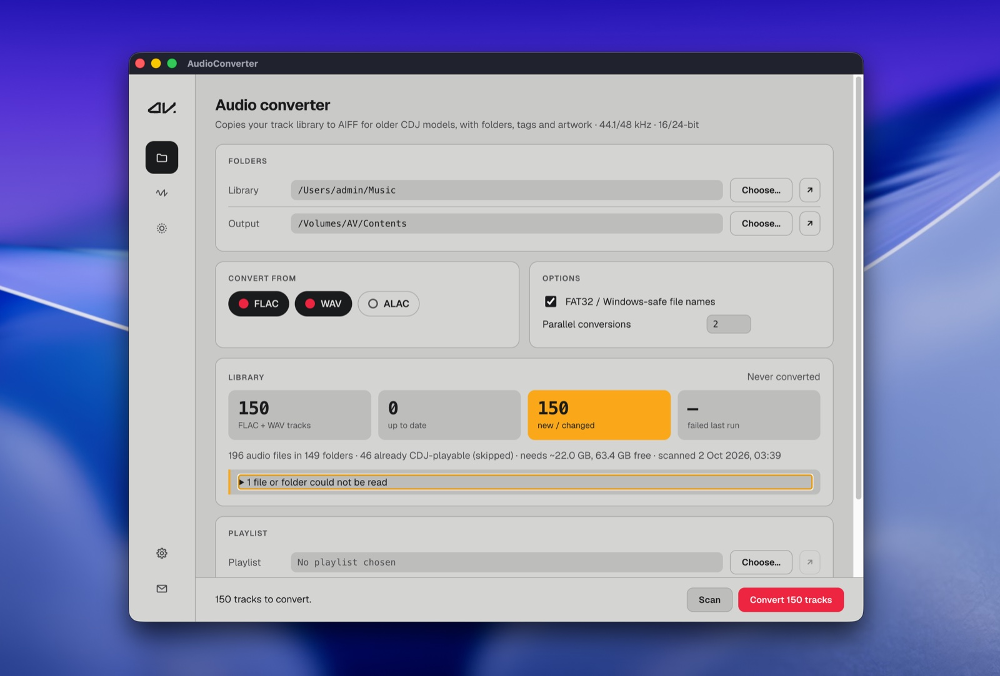
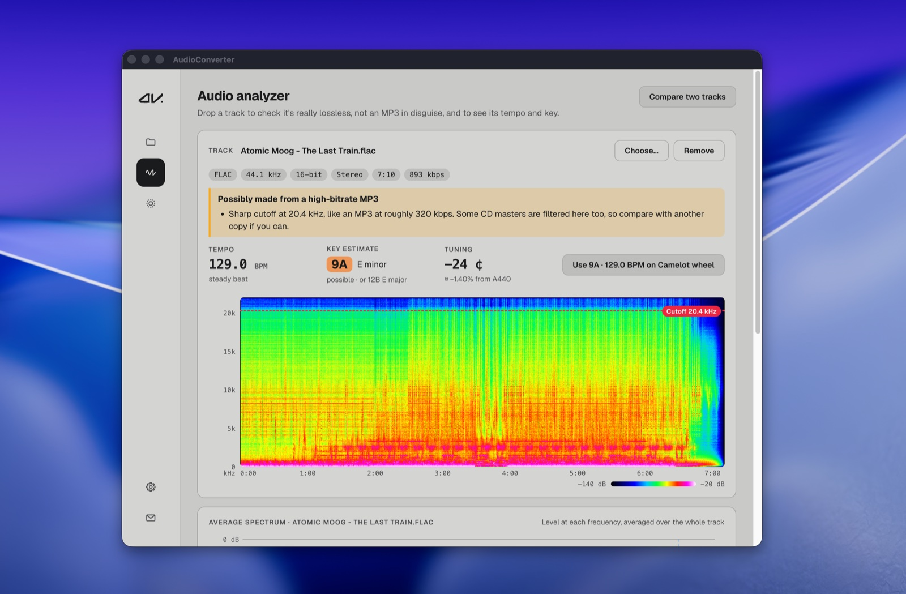
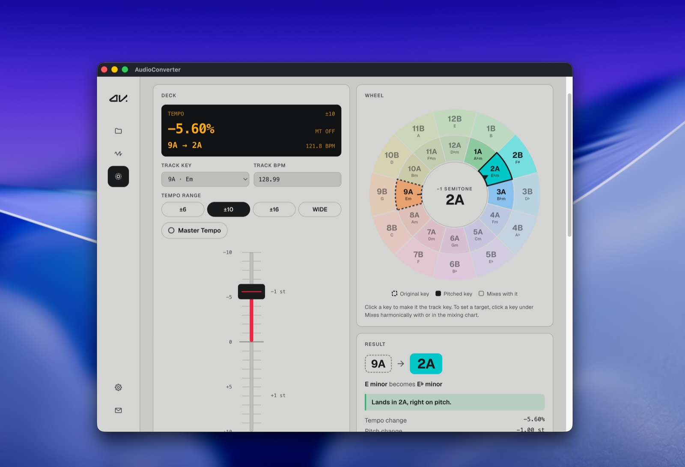

# AudioConverter

Mirrors a FLAC/WAV/ALAC music library into **CDJ-safe AIFF** for players that can't read FLAC or ALAC, such as the Pioneer **CDJ-2000NXS (NXS1)**. It keeps the folder structure, tags, key/BPM and artwork. After the first run, only new or changed tracks are converted.

It runs on macOS, Windows and Linux as an Electron desktop app, and also has a CLI. It also has an **audio analyzer** (is this FLAC really lossless?) and a **Camelot wheel** (what the tempo fader does to a track's key). Problems and ideas: hello@averyano.com

<p align="center">
  
</p>
<p align="center">
  
  
</p>

<h1 align="center"><a href="https://github.com/Averyano/av-audio-cdj-tools/releases/latest">⬇ Download</a></h1>
<p align="center">Free, for Mac, Windows and Linux. Not sure which file to pick? See <a href="#download">how to install</a>.</p>

## Which players need this?

Many Pioneer DJ players read MP3, AAC, WAV and AIFF from USB, but **not FLAC or ALAC**, and they only take WAV/AIFF at **44.1 or 48 kHz, 16 or 24-bit**. A FLAC on the stick shows as unplayable, and a hi-res 96 kHz or 192 kHz file won't load. AudioConverter fixes both: it turns FLAC, ALAC and hi-res WAV into AIFF the player accepts, resampled to 44.1/48 kHz.

It's built for the **CDJ-2000NXS**. These players have the same format limits, so the same AIFF output suits them too (check your player's manual to be sure):

- **CDJ-2000NXS**, **CDJ-2000** (original)
- **CDJ-900NXS**, **CDJ-900**
- **CDJ-850**, **CDJ-350**
- **XDJ-1000** (original), **XDJ-700**
- **XDJ-RX** (original), **XDJ-R1**

Searching for "CDJ FLAC support", "FLAC to AIFF converter for CDJ", "convert hi-res WAV to 44.1 kHz", "ALAC to AIFF" or "rekordbox USB won't play FLAC"? This is what it's for. Newer players such as the CDJ-2000NXS2, CDJ-3000, XDJ-1000MK2 and XDJ-RX2 play FLAC already. AudioConverter can still turn hi-res files into a format every player in a mixed booth accepts.

## Download

Get the latest release from **[Releases](https://github.com/Averyano/av-audio-cdj-tools/releases/latest)**:

| Your computer | File |
|---|---|
| Mac with Apple Silicon (M1 or later) | `AudioConverter-<version>-mac-arm64.dmg` |
| Mac with an Intel processor | `AudioConverter-<version>-mac-x64.dmg` |
| Windows 10/11, 64-bit | `AudioConverter-<version>-win-x64.exe` |
| Linux, 64-bit | `AudioConverter-<version>-linux-….AppImage` |

The same page has the source code as zip / tar.gz.

**First launch.** The installers aren't signed by Apple or Microsoft, so the first launch needs one extra step:
- **Mac:** drag AudioConverter into Applications and open it. When macOS says it can't verify the app, open **System Settings → Privacy & Security** and click **Open Anyway**.
- **Windows:** if SmartScreen says "Windows protected your PC", click **More info → Run anyway**.
- **Linux:** `chmod +x AudioConverter-*.AppImage`, then run it.

**ffmpeg.** AudioConverter uses [ffmpeg](https://ffmpeg.org/download.html) to convert and decode audio. The installers don't include it. If the app can't find it, it says so and links to the download page:
- **Mac:** `brew install ffmpeg` (with [Homebrew](https://brew.sh)). The app finds Homebrew's ffmpeg by itself.
- **Debian/Ubuntu:** `sudo apt install ffmpeg`.
- **Windows:** download a build from ffmpeg.org, unzip it, and choose its `bin\ffmpeg.exe` in **Settings → ffmpeg → Choose…**.

**Updates.** Each time it starts, the app asks GitHub once whether there's a newer release; if there is, it shows what changed and a button to download it. That request is all it sends, and GitHub sees your IP address. **Settings → About → Check now** checks again.

## What it produces

| Source | Output |
|---|---|
| 44.1 / 48 kHz | same rate |
| 88.2 / 176.4 kHz | 44.1 kHz |
| 96 / 192 kHz | 48 kHz |
| ≤16-bit | 16-bit |
| 24-bit, 32-bit int, 32-bit float | 24-bit |
| >2 channels | stereo downmix |

- **Container:** always plain AIFF (`pcm_s16be` / `pcm_s24be`), never AIFF-C, which the NXS1 rejects.
- **Tags:** written as ID3v2.3 into an `ID3 ` chunk, which is what rekordbox and older CDJs read:
  - title, artist, album, album artist, genre, year, track/disc
  - **BPM (TBPM), key (TKEY, including Vorbis `INITIALKEY`), label (TPUB)**
  - comment (COMM), ISRC, remixer, composer, grouping, catalog number
  - front cover (APIC)
- **Checked before use:** every output is re-read before it replaces anything (container, sample rate, bit depth, and duration within ±0.5 s).
- **Skipped:** files the CDJ already plays (MP3, AAC, compatible AIFF, and WAV when unticked) are counted but not copied.
- **Playlists:** the Playlist card relinks an `.m3u8` to the converted files. It shows found and missing tracks side by side, lets you choose missing ones by hand, and saves `av-<name>.m3u8`.
- **Never deleted:** the tool never removes anything from the output folder. If a source is deleted, its AIFF stays and is reported as "removed from library".

## Using the app

The icon bar on the left switches tools. The **folder** icon is the converter, and it's where the app opens. The **wave** is the audio analyzer and the **dotted wheel** the Camelot wheel. On a wide window the Camelot page spreads out and keeps the wheel pinned on the right. At the bottom, the **cog** opens Settings (analyzer, Camelot and ffmpeg options, plus the version and updates; a green dot means a newer version is out) and the **envelope** shows our email address, hello@averyano.com. A red dot on the folder icon means a scan or conversion is still running.

### Convert your library
1. **Folders:** choose your **Library** (FLAC/WAV/ALAC source) and an **Output** folder. They must be separate; neither may sit inside the other.
2. **Convert from:** tick FLAC, WAV and/or ALAC. ALAC is read from `.m4a` files (and `.alac`); an AAC `.m4a` already plays on the CDJ and is left as it is. FAT32/Windows-safe names stay on unless you have a reason to turn them off.
3. **Scan** (it also runs automatically on launch) shows:
   - how many tracks are up to date and how many are new or changed
   - what's skipped
   - space needed
   - warnings
4. **Convert N tracks** converts only what's new or changed. *Last converted* shows the date and count of the last run. **Cancel** is safe; the next run picks up where it stopped.

### Audio analyzer (is my FLAC really lossless?)
1. **Drop a track** on the card, or click **Choose…**. FLAC, WAV, AIFF, MP3 and most other formats work.
2. The **verdict** says whether it's **real lossless** or **made from an MP3** (a "fake FLAC"), with a guess at the MP3's bitrate, e.g. *about 128 kbps*. Cutoffs around 20 kHz only get *possibly*, because some CD masters stop there too.
3. The **spectrogram** shows why (in colour by default; *Settings → Audio Analyzer → Spectrogram colours* switches to grayscale). Brightness is loudness and height is frequency. Real lossless audio goes up to about 20–22 kHz; a hard edge with black above it (around 16–20 kHz) is where an MP3 encoder cut the sound off. A red line marks the cutoff.
4. **Want to check studio hi-res too** (88.2 kHz and up, not upsampled CD audio)? Turn on *Settings → Audio Analyzer → Also check hi-res claims*.
5. **Compare two tracks** (or drop two files at once) to see two versions side by side on one frequency scale, plus their average spectrum.

A few seconds after the spectrogram, the card also shows the track's **tempo** (to 0.1 BPM), a **key estimate** and its tuning; **Use … on Camelot wheel** takes them to the deck.

The analyzer only reads files; it never changes them. It's a strong hint, not proof: very high-quality MP3s (VBR V0) and AACs can leave no edge and pass as real.

### Camelot wheel (pitch shift)
For mixing by key on a CDJ with **Master Tempo off**, where moving the tempo fader also moves the key.

1. Set the track's **key** and **BPM** (or click a key on the wheel: that makes it the track key and clears any target), and pick the **tempo range** your CDJ is on.
2. Move the **fader** (minus at the top, like the deck). The display shows the new tempo, BPM and the key the track lands in, e.g. `1A → 8A`, plus how many cents it is off.
3. **Exact key landings** lists the fader settings that land exactly on a key; click one to jump there.
4. **Mixes harmonically with** and the **mixing chart** suggest next keys. Click one to set it as your **target**: the result then shows, e.g., *2B → 1B · F♯ major becomes B major*, how the two mix, and the fader setting that pitches your track there. Only settings within ±16 % are offered (at most 2 semitones); a target further away says to mix the two as they are. **Make … the track key** switches to it.

Your last deck settings are remembered.

**Listen** (top right) works out a playing track's tempo, a **key estimate** and tuning in 10 seconds. On a Mac with a multichannel audio interface, the **Input** list offers every pair of its inputs, e.g. *Scarlett 6i6 USB · inputs 3/4* for CDJs plugged into line inputs 3/4. Your choice is remembered. Feed it your mixer's REC out through an audio interface (best), or let the laptop mic hear the speakers. **Use … BPM** and **Use key …** put them on the deck; to have the BPM applied straight away, turn on *Settings → Camelot Wheel → Automatically apply analyzed BPM*. The key is an estimate (on a techno library it agreed with rekordbox about half the time), so it always waits for its button; *no clear key* means the music gave too little to go on. If the tempo comes out half or double, use **½×** / **2×**. The tuning shows how far the track sounds from concert pitch, e.g. *+23 ¢ ≈ +1.34 %* when a deck is pitched up with Master Tempo off. The first time, macOS asks for microphone access. The sound is analysed on your computer and never saved.

### Convert a playlist
For playlists that point at your FLAC library, e.g. exported from rekordbox as `.m3u8`.

1. **Playlist:** choose the `.m3u8`/`.m3u`.
2. **Converted:** shows your Output folder (greyed out). Tick **Use a different converted folder** to point at another copy, e.g. on a USB stick.
3. **Convert playlist** (red) shows the original and converted track lists side by side.
   - **Green rows** were found. Tracks the CDJ already plays (MP3…) are kept as **original**.
   - **Yellow rows** are missing. Click the **folder icon** on a row to choose the file. Picking the original FLAC automatically uses its converted AIFF.
   - **Find in folder** (shown only while tracks are missing) searches a folder for all missing tracks at once. Tick **Recursive** to include subfolders; whole drives and the home folder are refused.
4. **Create playlist** saves `av-<name>.m3u8` (the prefix is editable) next to the original. Missing tracks are left out. Import it into rekordbox.

## Requirements

| Need | Details |
|---|---|
| **Node.js ≥ 22.12** (includes npm) | The only thing to install yourself. Use the LTS from [nodejs.org](https://nodejs.org) on macOS or Windows; it's also enforced in `package.json` → `engines`. |
| Internet on first `npm install` | Downloads Electron (~310 MB) and a static ffmpeg (~45 MB) for the current OS. Total `node_modules` ≈ 460 MB. |
| **ffmpeg** | From source: nothing to install; `ffmpeg-static` (a dev dependency) provides it. The installers don't include ffmpeg and use the one on the computer (see *Download*). Either way, *Settings → ffmpeg → Choose…* picks a specific build; the CLI's `--ffmpeg <path>` does the same. |
| OS | macOS (Apple Silicon or Intel), Windows 10/11 x64, Linux x64. Windows and Linux haven't been tested on real machines yet. |
| Disk for output | AIFF is ~1.8× the size of FLAC. The scan shows the estimate against free space. |

For building installers, electron-builder fetches its own tools, but each OS must be built on that OS (see *Packaging*).

## Run it

```bash
npm install          # downloads Electron + a static ffmpeg for this OS
npm start            # desktop app
npm test             # unit + end-to-end tests (generates fixtures with ffmpeg)
```

With npm ≥ 11 you may need to allow install scripts once. They are already listed under `allowScripts` in `package.json`. If they were blocked, run `npm approve-scripts electron ffmpeg-static`.

### Moving to another machine (e.g. Windows)
Copy the project **without** `node_modules/` and `dist/`, which hold OS-specific binaries:

```bash
zip -r audioconverter.zip . -x "node_modules/*" "dist/*"
```

Then, on the other machine:
1. install Node.js
2. `npm install`
3. `npm test`
4. `npm start`

Settings and conversion history don't travel. Choose the folders again; existing AIFFs in the output folder are recognised, not reconverted.

### CLI

```bash
node src/cli.js scan    --in ~/Music/DJ --out /Volumes/USB/DJ
node src/cli.js convert --in ~/Music/DJ --out /Volumes/USB/DJ [--formats flac,wav] [--workers 4] [--unsafe-names]
```

The CLI and the app share state, so a library converted in one is up to date in the other.

## How incremental runs work

1. **Walk:** the input tree is walked in full on every run. This is cheap and is how new files are found. Dotfiles (including macOS `._x.flac`), system folders and symlinks are skipped.
2. **Probe:** only files that are new, or whose size or mtime changed, are read with `music-metadata`. This reads headers only, not audio.
3. **Plan:** each file's action, target format and output path are worked out.
   - Names are FAT32/Windows-safe by default: `: ? * " < > | \` become `_`, reserved names like `CON` are changed, and names are NFC-normalised.
   - Name clashes such as `X.flac` + `X.wav` get a ` (wav)` suffix. Once a file has an output name, it keeps it on later runs.
4. **Check:** a track counts as up to date if both are true:
   - the manifest says it was converted from this exact size + mtime;
   - the output still exists.

   If the manifest is lost, an output that is newer than its source is adopted again, so a lost manifest doesn't mean reconverting everything.
5. **Convert:** a pool of ffmpeg processes runs. Each writes `name.aiff.part`, gets the ID3 chunk appended, is verified, then renamed into place. Cancelling or crashing never leaves a half-written `.aiff`.

State lives outside the output folder, so the USB stick stays clean:
- macOS: `~/Library/Application Support/AudioConverter/`
- Windows: `%APPDATA%\AudioConverter\`

It contains `settings.json` and `libraries/<hash>.json`, one manifest per input/output pair. The manifest records which source file became which output file, which the Playlist card uses to relink playlists. Set `AUDIOCONVERTER_DATA_DIR` to use a different folder.

## CDJ-2000NXS reminders (shown as warnings in the app)

- The USB stick must be **FAT32 or HFS+**; exFAT and NTFS are not supported.
- Folders can be at most **8 levels** deep.
- Full paths must be **under 256 characters**.
- AIFF is roughly **1.8× the size of FLAC**. The scan estimates the space needed and compares it with free space.

## Packaging

```bash
npm run dist:mac     # dist/AudioConverter-<v>-mac-arm64.dmg and -mac-x64.dmg
npm run dist:win     # dist/AudioConverter-<v>-win-x64.exe   (run on Windows)
npm run dist:linux   # dist/AudioConverter-<v>-linux-….AppImage (run on Linux)
```

- **Releases** are built by GitHub Actions: `npm version patch|minor|major`, then `git push --follow-tags`. The workflow builds every OS into a draft release; write the notes there and publish it (`docs/desktop-app.md` → *Releases*).
- **Build each OS on that OS** (the workflow does).
- **Licence:** the app is MIT (`LICENSE`). The installers don't contain ffmpeg. A source checkout downloads `ffmpeg-static` for your own machine; on macOS that build is GPL + *nonfree*, so don't redistribute it.
- **Unsigned builds:** see *Download → First launch*. Mac builds are ad-hoc signed, so macOS offers *Open Anyway* instead of calling the app damaged.

## Layout

```
src/engine/            pure Node, shared by app, CLI and tests:
                       walk, probe, plan, names, tags, id3, ffmpeg, manifest, playlists, engine
src/main/              Electron main process + sandboxed preload bridge
src/renderer/          UI: index.html, app.js (vanilla, no build step)
src/renderer/shared/   styles/ (index.css, fonts.css), fonts/ (Geist), images/ (logo, icons/)
src/cli.js             command line (library scan/convert)
test/                  node:test: unit, e2e, playlist (fixtures generated with ffmpeg)
docs/                  developer docs; start at docs/README.md
```

## Development

- **No dev server, no port, no hot reload.** `npm start` opens the same files the packaged app uses, loading the page from disk.
- **Applying changes:**
  - HTML/CSS/`app.js`: reload the window with **Cmd+R** (Ctrl+R).
  - `src/main/*` or `src/engine/*`: quit and run `npm start` again.
- **DevTools:** **Alt+Cmd+I** (View → Toggle Developer Tools).
- **Isolating experiments:** `AUDIOCONVERTER_DATA_DIR=/tmp/x npm start` keeps them away from your real settings and history.
- **More detail:** see `docs/desktop-app.md` → *Development workflow*.

## Not yet

- rekordbox XML relink (M3U/M3U8 is done)
- FLAC analysis
- Library visualisation
- More source formats (e.g. hi-res AIFF): add them in `src/engine/constants.js` and `plan.js`
